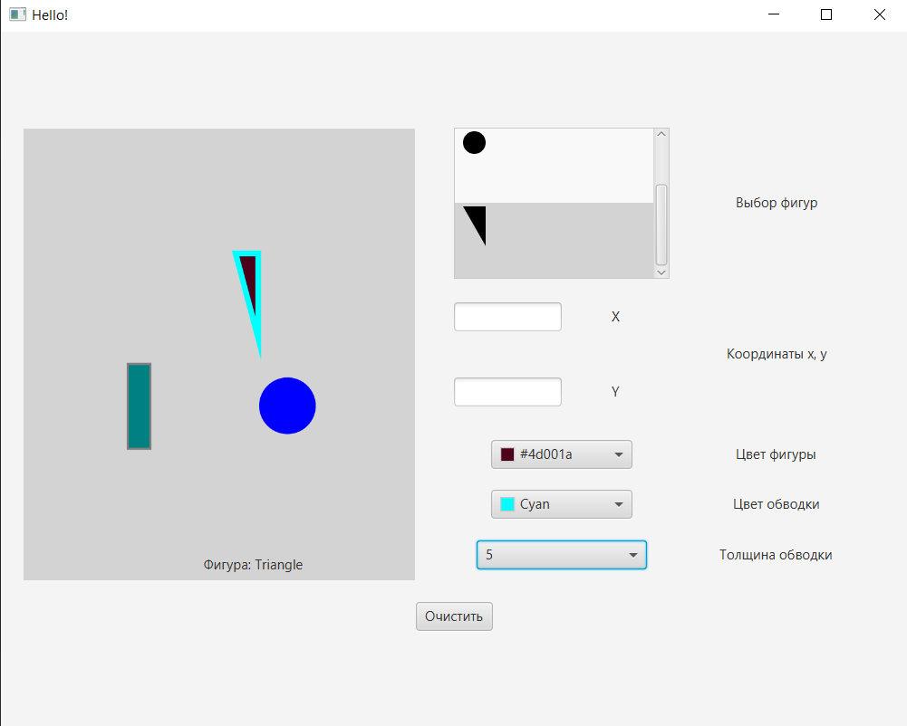
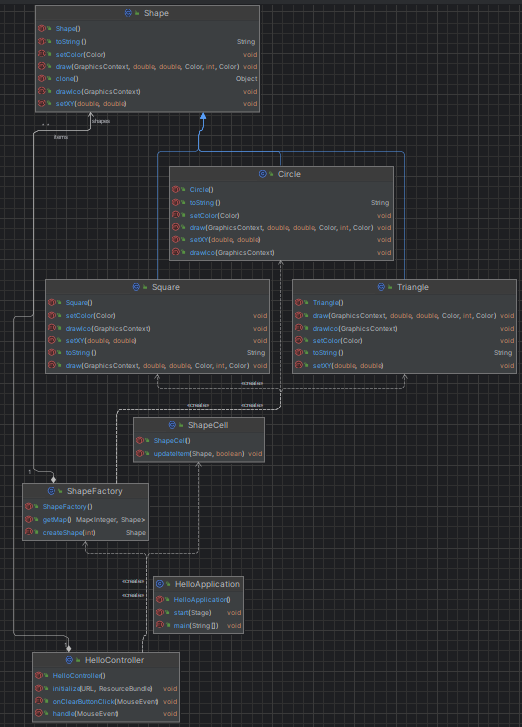

# Lab2 Shape Factory и Clone
**Описание:** В данном репозитории представлена программа для рисования фигур. 
В ней применен такой паттерн как Factory, который позволяет создать интерфейс для рисования любой фигуры. 
Для использования данного приложения вам необходимо:
* **Технологический стек**: Java. Данное ПО предназначено как автономное;
* **Статус**: v1.0.1;

**Скриншот рабочего окна приложения:**

## Архитектура
**Скриншот диаграммы классов:**

## Зависимости
Язык программироваия **Java**, комплект разработчика приложений **JDK 17**, а также инструментарий GUI **JavaFX**.
## Конфигурация
Для данного ПО не требуется специальная настройка
## Применение
Для использования данной программы вам необходимо:
* Выбрать фигуру, которую хотите нарисовать;
* Выбрать цвет фигуры;
* Выбрать цвет обводки;
* Нажать ЛКМ на поле для рисования;
* Для очистки поля для рисования необходимо нажать на кнопку *Очистить*;

